# ☁️ Cloud Deployment Approach

## ✅ Summary of Requirements and Decisions

- **Purpose**: Hosting a simple fullstack web app (frontend + backend in one container).
- **Container**: Single Flask-based container serving both frontend and backend over HTTP.
- **DNS**: Managed by **Route 53** for custom domain and integration with CloudFront.
- **SSL Termination**: Handled by **CloudFront**. The container only speaks HTTP.
- **ECS Launch Type**: EC2.
- **Load Balancer**: Not used (by design).
- **Autoscaling**: Not used (by design).
- **Public Access**: EC2 instance is in a **public subnet** with an **Elastic IP**. We are aware of the risk of bypassing CloudFront and accepts it.
- **S3 Usage**: Only used to store a `config.json` file for the backend.
- **ECR Usage**: Stores the Docker image for the ECS task.
- **IAM**: The recommended IAM roles and permissions.
- **Monitoring**: **CloudWatch** is included for logging and metrics.

## 🧩 Final AWS Architecture for Fullstack Web App (Single Container, No ALB, With CloudWatch)

### 1. DNS & Domain Management
- **Route 53**:
  - Manages DNS records for the custom domain (e.g., your-app.com)
  - Routes user traffic to CloudFront via ALIAS or A record

### 2. Networking
- **VPC** with:
  - **1 Public Subnet**
  - **Internet Gateway**
- **Security Group**:
  - Allow **HTTP (port 80)** from CloudFront (restricted by security group)
  - Allow **outbound HTTPS (port 443)** for ECR and S3 access

### 3. Content Delivery & SSL Termination
- **CloudFront**:
  - Handles **SSL termination**
  - Forwards requests to EC2’s **Elastic IP** over **HTTP**
  - Ensures end users only interact via **HTTPS**

### 4. Compute
- **ECS Cluster (EC2 launch type)**:
  - **EC2 instance** in public subnet
  - **ECS Task** running a **single Flask container**
  - **Elastic IP** attached to EC2

### 5. Storage
- **S3 Bucket**:
  - Stores only `config.json`
  - Accessed by Flask app via **S3 VPC Endpoint** (optional)

### 6. Container Registry
- **ECR**:
  - Stores Docker image
  - ECS pulls image using **ECS Task Execution Role**

### 7. IAM Roles
- **ECS Task Execution Role**:
  - Pull from ECR
  - Read `config.json` from S3
- **EC2 Instance Role**:
  - Write logs and metrics to **CloudWatch**

### 8. Monitoring
- **CloudWatch**:
  - Collects logs from EC2 and ECS tasks
  - Enables basic monitoring and alerting

### Key Features
- **Anonymous access:** The app is publicly accessible from all regions via CloudFront.
- **No NAT Gateway, ALB, or Autoscaling:** Simple, cost-effective architecture for small/medium workloads.
- **Public subnet:** EC2 instance is in a public subnet, but all traffic is routed through CloudFront for security and performance.

## Architecture Diagram

```mermaid
flowchart LR
    %% Internet and Entry
    User["🧑‍💻 User"]

    %% AWS Cloud Boundary
    subgraph AWSCloud["⛅ AWS Cloud (us-east-1)"]
        Route53["🌐 Route 53<br>your-app.com"]
        CloudFront["🛡️ CloudFront<br>SSL Termination"]

        %% VPC Boundary
        subgraph VPC["VPC (10.42.0.0/28)"]
            IGW["🌐 Internet Gateway"]

            %% Public Subnet Boundary
            subgraph PublicSubnet["Public Subnet (10.42.0.0/28)"]
                EIP["🔗 Elastic IP"]
                SG["🔒 Security Group<br>Allow 80 in, 443 out"]
                subgraph ECSCluster["ECS Cluster (EC2 launch type)"]
                    EC2["🖥️ EC2 (ECS-Optimized)<br>Docker + ECS Agent<br>Flask App (HTTP 80)"]
                end
            end
        end

        %% AWS Services (global, not in VPC)
        ECR["📦 ECR<br>Docker Image"]
        S3["🪣 S3<br>config.json"]
        CloudWatch["📈 CloudWatch<br>Logs & Metrics"]

        %% IAM Roles (conceptual, not physical)
        ECSRole["🔑 ECS Task Execution Role"]
        EC2Role["🔑 EC2 Instance Role"]
    end

    %% User Flow
    User -- "DNS Query" --> Route53
    Route53 -- "ALIAS/ANAME" --> CloudFront
    User -- "HTTPS (443)" --> CloudFront
    CloudFront -- "HTTP (80)" --> EIP
    EIP -- "public mapping" --> IGW
    IGW -- "routes to" --> PublicSubnet
    EIP -- "NAT" --> EC2

    %% Networking context
    CloudFront -.-> IGW
    VPC --> PublicSubnet
    VPC --> PublicSubnet
    PublicSubnet --> EIP
    PublicSubnet --> SG
    SG --> EC2

    %% Service Integrations
    EC2 -- "Pull Image<br>HTTPS (443)" --> ECR
    EC2 -- "Get config.json<br>HTTPS (443)" --> S3
    EC2 -- "Logs & Metrics<br>HTTPS (443)" --> CloudWatch

    %% IAM Roles
    EC2 -.-> EC2Role
    EC2 -.-> ECSRole
    ECSRole -.-> ECR
    ECSRole -.-> S3
    EC2Role -.-> CloudWatch
```

## Cost Estimation

| AWS Service      | Resource Type        | Est. Monthly Cost (USD) | Notes |
|------------------|----------------------|-------------------------|-------|
| EC2              | t3.medium (on-demand)| ~$28                    | 2 vCPU, 4GB RAM, 24/7 |
| EBS              | 8GB gp3              | ~$0.80                  | Root volume |
| ECS              | Control plane        | $0                      | No extra charge |
| S3               | 1GB storage          | ~$0.03                  | Config and small assets |
| ECR              | 1GB storage          | ~$0.10                  | Docker image |
| Route53          | Hosted zone + DNS    | ~$0.50                  | +$0.40 per million queries |
| CloudFront       | 100GB data transfer  | ~$8.50                  | Low traffic |
| CloudWatch       | Logs (1GB)           | ~$0.50                  | Scales with usage |
| **Total (est.)** |                      | **~$38**                | For low traffic |

> **Note:** Costs are approximate and may vary by region, usage, and reserved pricing. For a dev/test environment, costs can be much lower.