# ☁️ Cloud Deployment Approach

This project is designed for seamless deployment to AWS using a single ECS EC2 instance, with supporting services for security, scalability, and maintainability. The deployment leverages:

- **ECS (EC2 launch type):** Runs the Docker container on a dedicated EC2 instance.
- **ECR:** Stores the Docker image for the application.
- **S3:** Stores backend configuration (`config.json`) and can be used for other assets.
- **Route53:** Manages DNS for your custom domain.
- **CloudFront:** Provides HTTPS termination, caching, and global distribution in front of the app.
- **CloudWatch:** Centralized logging and monitoring for the container and infrastructure.

### Key Features
- **Anonymous access:** The app is publicly accessible from all regions via CloudFront.
- **No NAT Gateway, ALB, or Autoscaling:** Simple, cost-effective architecture for small/medium workloads.
- **Public subnet:** EC2 instance is in a public subnet, but all traffic is routed through CloudFront for security and performance.

## Architecture Diagram

```mermaid
flowchart LR
    subgraph "🌍 Internet"
        User("🧑‍💻 User")
    end

    subgraph "⛅ AWS Cloud"
        Route53["🌐 Route 53<br>your-app.com"]
        CloudFront["🛡️ CloudFront Distribution"]
        subgraph "VPC"
            subgraph "Public Subnet"
                EC2["
                    <b>🖥️ EC2 Instance</b>
                    <i>(ECS-Optimized AMI)</i>
                    <br>
                    - ECS Agent
                    - Docker Engine
                    - App Container (Port 80)
                "]
            end
        end

        ECR["📦 ECR<br>Docker Image"]
        S3["🪣 S3<br>config.json"]
        CloudWatch["📈 CloudWatch<br>Logs"]
    end

    %% --- Connections & Protocols ---

    %% User Facing
    User -- "DNS Query" --> Route53
    Route53 -- "ALIAS Record" --> CloudFront
    User -- "HTTPS / TCP 443" --> CloudFront

    %% CDN to Origin
    CloudFront -- "HTTP / TCP 80" --> EC2

    %% AWS Service Integrations (via IAM Role on EC2)
    EC2 -- "Pull Image<br>HTTPS / TCP 443" --> ECR
    EC2 -- "Get Config<br>HTTPS / TCP 443" --> S3
    EC2 -- "Send Logs<br>HTTPS / TCP 443" --> CloudWatch
```

## Cost Estimation

| AWS Service      | Resource Type        | Est. Monthly Cost (USD) | Notes |
|------------------|----------------------|-------------------------|-------|
| EC2              | t3.medium (on-demand)| ~$28                    | 2 vCPU, 4GB RAM, 24/7 |
| EBS              | 8GB gp3              | ~$0.80                  | Root volume |
| ECS              | Control plane        | $0                      | No extra charge |
| S3               | 1GB storage          | ~$0.03                  | Config and small assets |
| ECR              | 1GB storage          | ~$0.10                  | Docker image |
| Route53          | Hosted zone + DNS    | ~$0.50                  | +$0.40 per million queries |
| CloudFront       | 100GB data transfer  | ~$8.50                  | Low traffic |
| CloudWatch       | Logs (1GB)           | ~$0.50                  | Scales with usage |
| **Total (est.)** |                      | **~$38**                | For low traffic |

> **Note:** Costs are approximate and may vary by region, usage, and reserved pricing. For a dev/test environment, costs can be much lower.