# 🚀 Flask React Universal Starter

A turnkey, full-stack starter template for modern web applications. This project is designed to support three deployment strategies (the "evolutionary path") without requiring changes to the core application code:

1. **Local Development:** Run Flask and React separately for fast iteration and debugging.
2. **Containerized Monolith:** Build and run the entire stack in a single Docker container for production simulation or deployment.
3. **Composable Microservices:** Easily split frontend and backend into separate containers/services if needed in the future.

## Features
- **Backend:** Python, Flask, Gunicorn
- **Frontend:** React (Create React App)
- **Containerization:** Docker, Docker Compose, Nginx
- **VS Code:** Pre-configured debugging and tasks for a seamless developer experience
- **Source Control:** Proper `.gitignore` at both root and frontend levels

## Getting Started

### Local Development
1. **Install dependencies:**
   - Python 3.11+
   - Node.js 18+
2. **Backend:**
   ```sh
   cd backend
   pip install -r requirements.txt
   python main.py
   ```
3. **Frontend:**
   ```sh
   cd frontend
   npm install
   npm start
   ```
4. Open [http://localhost:3000](http://localhost:3000) in your browser.

### Docker (Production Simulation)
1. **Build and run with Docker Compose:**
   ```sh
   docker-compose up --build
   ```
2. Open [http://localhost:8080](http://localhost:8080) in your browser.

## Debugging in VS Code
- Use the **🚀 Launch ALL** compound configuration to start both backend and frontend debuggers.
- The `.vscode/tasks.json` ensures the frontend starts before debugging.

## Evolutionary Path
- **Monolith:** The default Dockerfile builds a single image for both frontend and backend.
- **Split Services:** You can later separate the frontend and backend into their own containers/services with minimal changes.

# ☁️ Cloud Deployment Approach

This project is designed for seamless deployment to AWS using a single ECS EC2 instance, with supporting services for security, scalability, and maintainability. The deployment leverages:

- **ECS (EC2 launch type):** Runs the Docker container on a dedicated EC2 instance.
- **ECR:** Stores the Docker image for the application.
- **S3:** Stores backend configuration (`config.json`) and can be used for other assets.
- **Route53:** Manages DNS for your custom domain.
- **Elastic IP (EIP):** Ensures a stable public IP for the EC2 instance.
- **CloudFront:** Provides HTTPS termination, caching, and global distribution in front of the app.
- **CloudWatch:** Centralized logging and monitoring for the container and infrastructure.

### Key Features
- **Anonymous access:** The app is publicly accessible from all regions via CloudFront.
- **No NAT Gateway, ALB, or Autoscaling:** Simple, cost-effective architecture for small/medium workloads.
- **Public subnet:** EC2 instance is in a public subnet, but all traffic is routed through CloudFront for security and performance.

## Architecture Diagram

```mermaid
flowchart
    subgraph AWSCloud [☁️ AWS]
        subgraph VPCBoundary [VPC]
            subgraph PublicSubnetBoundary [Public Subnet]
                EC2Instance["🖥️ EC2 Instance<br>(ECS Container)"]
            end
        end
        S3[("🪣 S3<br>Config Bucket")]
        ECR[("📦 ECR<br>Docker Image")]
        CloudWatch["📈 CloudWatch<br>Logs"]
        Route53["🗂️ Route53<br>DNS"]
        CloudFront["🛡️ CloudFront<br>HTTPS CDN"]
        EIP["🔗 EIP<br>Elastic IP"]
    end

    InternetUser["🌍 Internet User"]

    %% Connections
    InternetUser -- HTTPS:443 --> CloudFront
    CloudFront -- HTTP:80 --> Route53
    Route53 -- HTTP:80 --> EIP
    EIP -- HTTP:80 --> EC2Instance
    EC2Instance -- HTTPS:443 --> S3
    EC2Instance -- HTTPS:443 --> ECR
    EC2Instance -- HTTPS:443 --> CloudWatch

    %% Show boundaries visually
    class AWSCloud boundary;
    class VPCBoundary boundary;
    class PublicSubnetBoundary boundary;
```



## Cost Estimation

| AWS Service      | Resource Type        | Est. Monthly Cost (USD) | Notes |
|------------------|----------------------|-------------------------|-------|
| EC2              | t3.medium (on-demand)| ~$28                    | 2 vCPU, 4GB RAM, 24/7 |
| EBS              | 8GB gp3              | ~$0.80                  | Root volume |
| EIP              | Elastic IP           | $0 (if attached)        | $7.20/mo if not attached |
| ECS              | Control plane        | $0                      | No extra charge |
| S3               | 1GB storage          | ~$0.03                  | Config and small assets |
| ECR              | 1GB storage          | ~$0.10                  | Docker image |
| Route53          | Hosted zone + DNS    | ~$0.50                  | +$0.40 per million queries |
| CloudFront       | 100GB data transfer  | ~$8.50                  | Low traffic |
| CloudWatch       | Logs (1GB)           | ~$0.50                  | Scales with usage |
| **Total (est.)** |                      | **~$38**                | For low traffic |

> **Note:** Costs are approximate and may vary by region, usage, and reserved pricing. For a dev/test environment, costs can be much lower.
