# turnkey

A full-stack serverless application with a Python backend and a React frontend.

## Cloud Architecture

The application is deployed on AWS and uses the following services:

*   **Route 53:** For DNS management of the custom domain.
*   **CloudFront:** As a CDN for the frontend, providing SSL termination and caching.
*   **S3:** To host the static frontend assets (HTML, CSS, JavaScript).
*   **API Gateway:** To expose the backend Lambda function as a RESTful API.
*   **Lambda:** To run the backend code in a serverless environment.
*   **CloudWatch:** For logging and monitoring.

### Mermaid Diagram

```mermaid
graph LR
    subgraph "🌐 Serverless Frontend"
        direction LR
        A[💻 User] --> B{🛡️ AWS CloudFront};
        C[📜 Domain Registrar] --> D{🌐 AWS Route 53};
        D --> B;
        E[🔒 AWS Certificate Manager] --> B;
        B --> F[📦 Static Website Hosting - S3];
    end

    subgraph "⚙️ Serverless Backend"
        direction LR
        G[🔄 API Gateway] --> H[λ Lambda];
        H --> I[🔑 IAM];
    end

    F --> G;
```



## Developer's Guide

### Prerequisites

*   [Node.js](https://nodejs.org/) (v14 or later)
*   [Python](https://www.python.org/) (v3.9 or later)
*   [AWS CLI](https://aws.amazon.com/cli/)
*   [AWS SAM CLI](https://docs.aws.amazon.com/serverless-application-model/latest/developerguide/serverless-sam-cli-install.html) (optional, for SAM-based local development)
*   [Docker](https://www.docker.com/) (optional, for SAM-based local development)

### Setup

1.  **Clone the repository:**
    ```bash
    git clone <repository-url>
    cd turnkey
    ```

2.  **Install backend dependencies:**
    ```bash
    cd backend
    pip install -r requirements.txt
    cd ..
    ```

3.  **Install frontend dependencies:**
    ```bash
    cd frontend
    npm install
    cd ..
    ```

### Running Locally

This project uses a lightweight mock server to simulate the AWS Lambda environment for local development.

1.  **Start the backend server:**
    Open a terminal and run the following command:
    ```bash
    python backend/local_server.py
    ```
    The backend server will be running at `http://localhost:5001`.

2.  **Start the frontend server:**
    Open another terminal and run the following command:
    ```bash
    cd frontend
    npm start
    ```
    The frontend development server will be running at `http://localhost:3000`.

### Debugging

This project is pre-configured for debugging in Visual Studio Code.

1.  Open the project in VS Code.
2.  Go to the "Run and Debug" view.
3.  Select one of the following launch configurations from the dropdown:
    *   **Debug BE (Flask):** To debug the backend server.
    *   **Debug FE (Chrome):** To debug the frontend application in Chrome.
    *   **Debug FE+BE:** To debug both the frontend and backend at the same time.

## Cloud Deployment

The application is deployed using AWS CloudFormation.

1.  **Package the application:**
    ```bash
    aws cloudformation package --template-file template.yaml --s3-bucket <your-s3-bucket-for-deployment> --output-template-file packaged.yaml
    ```

2.  **Deploy the application:**
    ```bash
    aws cloudformation deploy --template-file packaged.yaml --stack-name turnkey --capabilities CAPABILITY_IAM --parameter-overrides DomainName=<your-domain-name> HostedZoneId=<your-hosted-zone-id>
    ```

## AWS Cost Estimation (Enterprise)

The following table provides a cost estimation for the services used in this application. Please replace the placeholder values with your enterprise pricing.

| Service | Dimension | Rate | Monthly Cost |
| :--- | :--- | :--- | :--- |
| AWS Lambda | 1M requests | $0.20 | $0.20 |
| | 400,000 GB-seconds | $0.00001667 | $6.67 |
| Amazon API Gateway | 1M API calls | $3.50 | $3.50 |
| Amazon S3 | 5 GB storage | $0.023 | $0.12 |
| | 20,000 Get Requests | $0.0004 per 1,000 | $0.01 |
| | 2,000 Put Requests | $0.005 per 1,000 | $0.01 |
| Amazon CloudFront | 10 GB data transfer | $0.085 | $0.85 |
| Amazon Route 53 | 1 hosted zone | $0.50 | $0.50 |
| **Total** | | | **$11.86** |

**Disclaimer:** This is a rough estimation. The actual cost will depend on the usage of the application.
